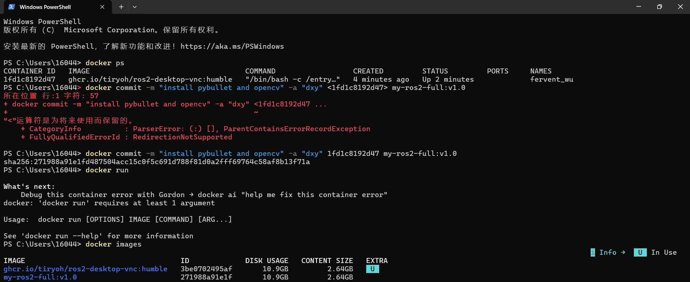
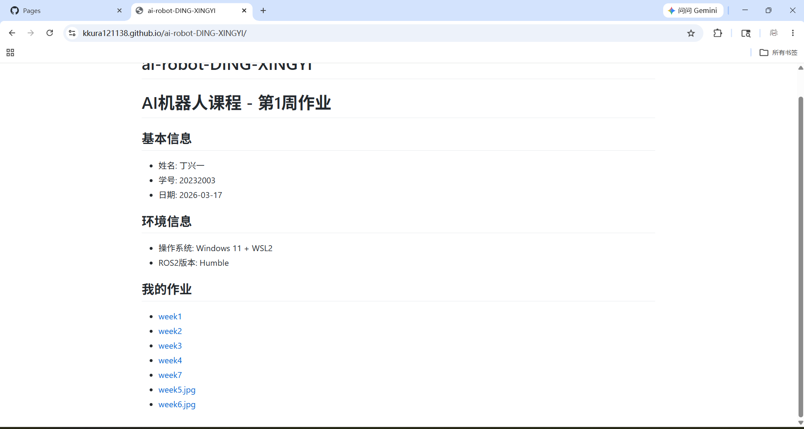

## Docker 环境配置  
1.运行 ROS2 Docker 容器：
docker run -p 6080:80 --security-opt seccomp=unconfined --shm-size=512m \-v "$(pwd)/:/home/ws" \ghcr.io/tiryoh/ros2-desktop-vnc:humble  
2.在容器内安装库（在浏览器 VNC 终端中）：
- 安装 pybullet
pip3 install pybullet --break-system-packages

- 安装 opencv
pip3 install opencv-python opencv-contrib-python --break-system-packages

- 如果需要，安装 numpy
pip3 install "numpy<2" --break-system-packages  
3.打开新终端，查看容器 ID：docker ps  
4.保存容器为新镜像：docker commit -m "install pybulletand opencv" -a "your-name" <容器ID> my-ros2-full:v1.0  
5.验证镜像已保存：docker images  

## 将 GitHub 作业仓库转为网页  
步骤 1：开启 GitHub Pages  
1.打开你的 GitHub 作业仓库页面  
2.点击仓库顶部的 Settings（设置）  
在左侧菜单中找到并点击 Pages  
在 "Source" 部分，选择：Source（源）：Deploy from a branch  
Branch（分支）：main（或 master）  
Folder（文件夹）：/ (root)  
3.点击 Save（保存）  
4.等待约 1-3 分钟，页面会显示：Your site is live at https://<你的用户名>.github.io/<仓库名>/  
我的网站： https://kkura121138.github.io/ai-robot-DING-XINGYI/  
