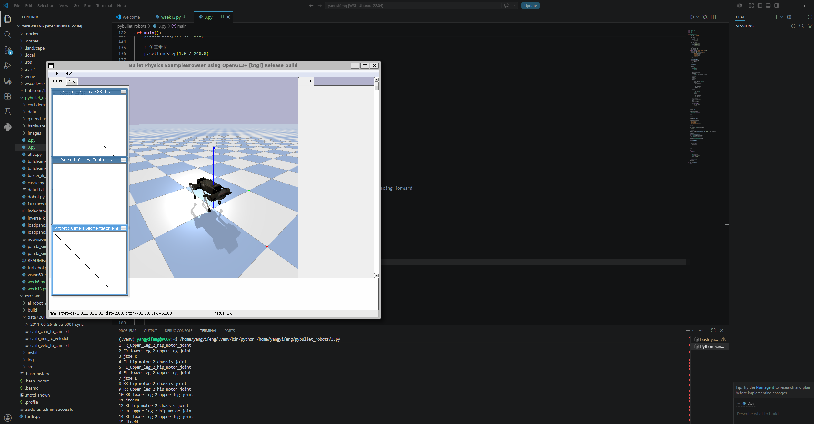

## 四足机器人入门  
- Trot步态实现  
1. 修复了机器狗方向错误（最重要）  
原始代码：  
start_orientation = p.getQuaternionFromEuler(
    [math.pi / 2, 0, math.pi / 2]
)  
修改后：  
start_orientation = p.getQuaternionFromEuler(
    [0, 0, 0]
)  
作用：  
修复机器人横着加载的问题
修复一启动就翻倒
修复身体方向错误
修复无法正常前进  
2. 修改了关节编号  
原始代码：  
self.leg_joints = {
    'LF': [0,1,2],
    'RF': [3,4,5],
    'LH': [6,7,8],
    'RH': [9,10,11]
}  
修改后：  
self.legs = {
    "FL": [0,1,2],
    "FR": [4,5,6],
    "RL": [8,9,10],
    "RR": [12,13,14]
}  
作用：  
修复控制错误关节
修复腿乱动
修复某些腿不受控制
因为 Laikago 的关节编号本来就不是连续的。  
 
3. 增加了稳定站立姿态  

新增：  

self.stand_pose = {
    "FL": [0.0, 0.67, -1.3],
    ...
}  

以及：  

controller.stand()  

作用：  

机器人先站稳
防止一启动摔倒
给行走做准备

原始代码没有“站立阶段”。  

4. 力矩大幅增强  

原始代码：  

force=20  

修改后：  

force=500  

作用：  

原来力太小撑不起身体
现在腿能真正支撑机器人

这是最关键修改之一。  

5. 新增最大速度限制

新增：  

maxVelocity=5

作用：

防止关节瞬间抽搐
行走更加平滑
提高稳定性  
6. 重写了步态算法

原始代码：

thigh = np.arctan2(x, target_height)
calf = -2 * thigh

修改后：

upper += -foot_forward * 0.8
lower += foot_forward * 1.2

作用：

不再使用错误简化逆运动学
改成更加稳定的步态控制
腿运动更加自然  
7. 新增抬腿动作

新增：

upper -= foot_up * 0.5
lower += foot_up * 0.8

作用：

机器人真正抬腿
防止拖地
行走更自然  
8. 新增对角步态（Trot）  

新增：  

phases = {
    "FL": 0,
    "RR": 0,
    "FR": math.pi,
    "RL": math.pi
}  

作用：

前左 + 后右同步
前右 + 后左同步
更符合真实四足机器人

原始代码虽然有相位，但实现不完整。  

9. 新增摄像机控制

新增：

p.resetDebugVisualizerCamera(...)

作用：

自动对准机器人
更容易观察运动  
10. 新增关节信息打印

新增：

print(i, info[1].decode("utf-8"))

作用：

调试方便
能查看真实关节编号  
11. 修改了机器人高度

原始：

[0,0,0.5]

修改后：

[0,0,0.48]

后面又建议：

[0,0,0.55]

作用：

防止腿插地
提高稳定性  
12. 新增 stand() 函数

新增：

def stand(self):  

作用：  

独立控制站立
结构更清晰
更容易后续扩展  
13. 代码结构优化  

原始代码：  

controller.step()

修改后：  

controller.stand()
controller.trot_gait()

作用：  

逻辑更清晰
更符合真实机器人控制流程  
